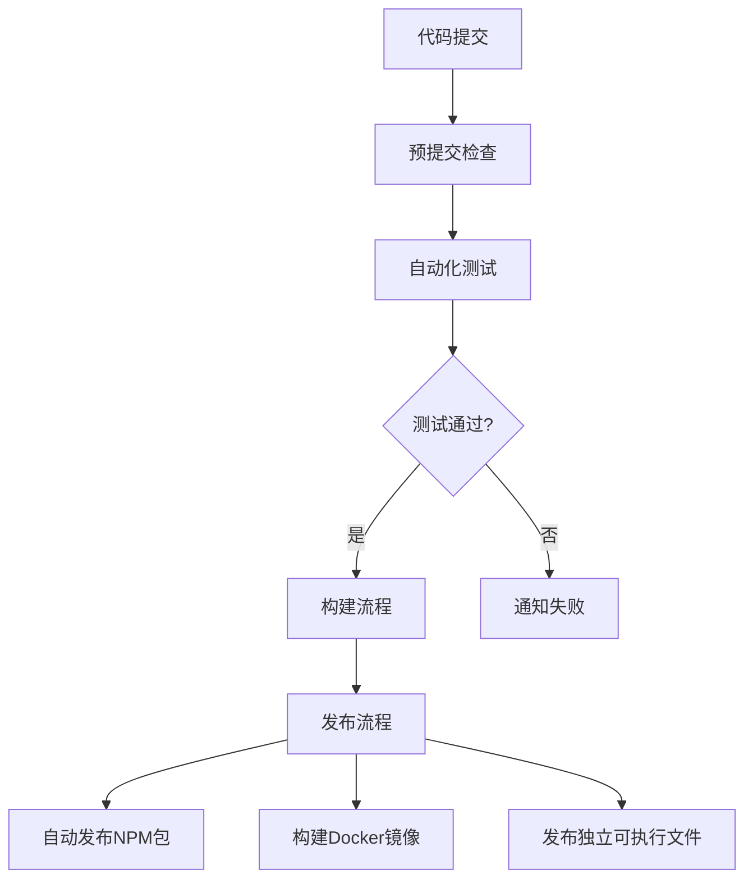

# GitHub自动化方案

## 持续集成与持续部署流程

针对代码分析工具项目，我们设计以下CI/CD流程，确保代码质量和自动化发布。

### 工作流概览



## GitHub Actions配置

### 主要工作流

以下是项目中需要实现的主要GitHub Actions工作流：

1. **代码质量检查**
2. **自动化测试**
3. **构建与发布**
4. **依赖更新**
5. **文档部署**

## 代码质量检查工作流

`.github/workflows/code-quality.yml`:

```yaml
name: Code Quality

on:
  push:
    branches: [ main, develop ]
  pull_request:
    branches: [ main, develop ]

jobs:
  lint:
    name: Lint
    runs-on: ubuntu-latest
    steps:
      - uses: actions/checkout@v3

      - name: Setup Node.js
        uses: actions/setup-node@v3
        with:
          node-version: 16
          cache: 'pnpm'

      - uses: pnpm/action-setup@v2
        with:
          version: 7

      - name: Install dependencies
        run: pnpm install

      - name: Run ESLint
        run: pnpm lint

      - name: Run Type Check
        run: pnpm type-check

  format:
    name: Format Check
    runs-on: ubuntu-latest
    steps:
      - uses: actions/checkout@v3

      - name: Setup Node.js
        uses: actions/setup-node@v3
        with:
          node-version: 16
          cache: 'pnpm'

      - uses: pnpm/action-setup@v2
        with:
          version: 7

      - name: Install dependencies
        run: pnpm install

      - name: Check Formatting
        run: pnpm format:check
```

## 自动化测试工作流

`.github/workflows/test.yml`:

```yaml
name: Tests

on:
  push:
    branches: [ main, develop ]
  pull_request:
    branches: [ main, develop ]

jobs:
  test:
    name: Test on Node.js ${{ matrix.node }} and ${{ matrix.os }}
    runs-on: ${{ matrix.os }}
    strategy:
      matrix:
        node: [14, 16, 18]
        os: [ubuntu-latest, windows-latest, macos-latest]

    steps:
      - uses: actions/checkout@v3

      - name: Setup Node.js ${{ matrix.node }}
        uses: actions/setup-node@v3
        with:
          node-version: ${{ matrix.node }}
          cache: 'pnpm'

      - uses: pnpm/action-setup@v2
        with:
          version: 7

      - name: Install dependencies
        run: pnpm install

      - name: Run tests
        run: pnpm test

      - name: Upload coverage to Codecov
        uses: codecov/codecov-action@v3
        with:
          token: ${{ secrets.CODECOV_TOKEN }}
          file: ./coverage/lcov.info
          flags: unittests
          name: codecov-umbrella
```

## 构建与发布工作流

`.github/workflows/release.yml`:

```yaml
name: Release

on:
  push:
    tags:
      - 'v*'

jobs:
  build:
    name: Build and Test
    runs-on: ubuntu-latest
    steps:
      - uses: actions/checkout@v3

      - name: Setup Node.js
        uses: actions/setup-node@v3
        with:
          node-version: 16
          cache: 'pnpm'

      - uses: pnpm/action-setup@v2
        with:
          version: 7

      - name: Install dependencies
        run: pnpm install

      - name: Run tests
        run: pnpm test

      - name: Build
        run: pnpm build

      - name: Upload artifacts
        uses: actions/upload-artifact@v3
        with:
          name: dist
          path: dist/

  publish-npm:
    name: Publish to NPM
    needs: build
    runs-on: ubuntu-latest
    steps:
      - uses: actions/checkout@v3

      - name: Setup Node.js
        uses: actions/setup-node@v3
        with:
          node-version: 16
          registry-url: 'https://registry.npmjs.org/'

      - uses: pnpm/action-setup@v2
        with:
          version: 7

      - name: Download artifacts
        uses: actions/download-artifact@v3
        with:
          name: dist
          path: dist/

      - name: Publish to NPM
        run: pnpm publish --no-git-checks
        env:
          NODE_AUTH_TOKEN: ${{ secrets.NPM_TOKEN }}

  build-binaries:
    name: Build Binaries
    needs: build
    runs-on: ${{ matrix.os }}
    strategy:
      matrix:
        os: [ubuntu-latest, windows-latest, macos-latest]
        include:
          - os: ubuntu-latest
            platform: linux
          - os: windows-latest
            platform: win
          - os: macos-latest
            platform: macos

    steps:
      - uses: actions/checkout@v3

      - name: Setup Node.js
        uses: actions/setup-node@v3
        with:
          node-version: 16

      - uses: pnpm/action-setup@v2
        with:
          version: 7

      - name: Download artifacts
        uses: actions/download-artifact@v3
        with:
          name: dist
          path: dist/

      - name: Install dependencies
        run: pnpm install

      - name: Build binary
        run: pnpm pkg --target node14-${{ matrix.platform }}-x64

      - name: Upload binary
        uses: actions/upload-artifact@v3
        with:
          name: code-insight-${{ matrix.platform }}
          path: pkg-builds/code-insight-${{ matrix.platform }}*

  create-release:
    name: Create GitHub Release
    needs: [publish-npm, build-binaries]
    runs-on: ubuntu-latest
    steps:
      - uses: actions/checkout@v3

      - name: Download Linux binary
        uses: actions/download-artifact@v3
        with:
          name: code-insight-linux
          path: ./binaries/

      - name: Download Windows binary
        uses: actions/download-artifact@v3
        with:
          name: code-insight-win
          path: ./binaries/

      - name: Download macOS binary
        uses: actions/download-artifact@v3
        with:
          name: code-insight-macos
          path: ./binaries/

      - name: Create Release
        id: create_release
        uses: softprops/action-gh-release@v1
        with:
          files: ./binaries/*
          draft: false
          prerelease: false
          generate_release_notes: true
```

## 依赖更新工作流

使用Dependabot自动更新依赖：

`.github/dependabot.yml`:

```yaml
version: 2
updates:
  # 更新npm依赖
  - package-ecosystem: "npm"
    directory: "/"
    schedule:
      interval: "weekly"
    open-pull-requests-limit: 10
    versioning-strategy: auto
    labels:
      - "dependencies"
    commit-message:
      prefix: "chore"
      include: "scope"

  # 更新GitHub Actions
  - package-ecosystem: "github-actions"
    directory: "/"
    schedule:
      interval: "monthly"
    labels:
      - "dependencies"
      - "github-actions"
```

## 文档部署工作流

`.github/workflows/docs.yml`:

```yaml
name: Deploy Documentation

on:
  push:
    branches: [ main ]
    paths:
      - 'docs/**'
      - '.github/workflows/docs.yml'

jobs:
  deploy:
    runs-on: ubuntu-latest
    steps:
      - uses: actions/checkout@v3

      - name: Setup Node.js
        uses: actions/setup-node@v3
        with:
          node-version: 16

      - uses: pnpm/action-setup@v2
        with:
          version: 7

      - name: Install dependencies
        run: pnpm install

      - name: Build documentation
        run: pnpm docs:build

      - name: Deploy to GitHub Pages
        uses: peaceiris/actions-gh-pages@v3
        with:
          github_token: ${{ secrets.GITHUB_TOKEN }}
          publish_dir: ./docs/dist
```

## Pull Request自动化

### PR模板

`.github/PULL_REQUEST_TEMPLATE.md`:

```markdown
## 描述

<!-- 请描述您的更改 -->

## 相关问题

<!-- 请链接相关问题或功能请求 -->

## 检查清单

- [ ] 我已添加适当的测试
- [ ] 我已更新相关文档
- [ ] 我已将我的分支与最新的main分支合并
- [ ] 我已本地运行测试并确认它们通过
- [ ] 我已本地运行lint并确认无错误
```

### PR自动标签

`.github/workflows/pr-labeler.yml`:

```yaml
name: PR Labeler

on:
  pull_request:
    types: [opened, synchronize, reopened]

jobs:
  label:
    runs-on: ubuntu-latest
    steps:
      - uses: actions/labeler@v4
        with:
          repo-token: "${{ secrets.GITHUB_TOKEN }}"
```

`.github/labeler.yml`:

```yaml
feature:
  - any: ['src/**/*.ts', '!src/**/*.spec.ts']
    title: '^feat:.*'

bugfix:
  - any: ['src/**/*.ts', '!src/**/*.spec.ts']
    title: '^fix:.*'

documentation:
  - any: ['docs/**/*', '*.md']
    title: '^docs:.*'

tests:
  - any: ['src/**/*.spec.ts', 'test/**/*']
    title: '^test:.*'

dependencies:
  - any: ['package.json', 'pnpm-lock.yaml']
    title: '^chore\(deps\):.*'
```

## Issue模板

### Bug报告模板

`.github/ISSUE_TEMPLATE/bug_report.md`:

```markdown
---
name: Bug报告
about: 创建一个bug报告帮助我们改进
title: '[BUG] '
labels: bug
assignees: ''
---

**描述bug**
清晰简洁地描述bug内容。

**复现步骤**
复现行为的步骤：
1. 前往 '...'
2. 点击 '....'
3. 滚动到 '....'
4. 查看错误

**预期行为**
清晰简洁地描述你预期应该发生什么。

**截图**
如果适用，添加截图以帮助解释你的问题。

**环境信息：**
 - OS: [例如 iOS]
 - Node.js版本: [例如 16.13.0]
 - 工具版本: [例如 1.0.0]

**其他上下文**
在此处添加有关问题的任何其他上下文。
```

### 功能请求模板

`.github/ISSUE_TEMPLATE/feature_request.md`:

```markdown
---
name: 功能请求
about: 为这个项目提出一个想法
title: '[FEATURE] '
labels: enhancement
assignees: ''
---

**您的功能请求是否与问题有关？请描述。**
清晰简洁地描述问题所在。例如，当[...]时我总是感到沮丧。

**描述您想要的解决方案**
清晰简洁地描述您希望发生的事情。

**描述您考虑过的替代方案**
清晰简洁地描述您考虑过的任何替代解决方案或功能。

**其他上下文**
在此处添加有关功能请求的任何其他上下文或截图。
```

## 代码所有者配置

`.github/CODEOWNERS`:

```
# 默认所有者
* @主要维护者用户名

# 核心引擎代码
/src/core/ @核心开发者用户名

# 测试文件
/test/ @测试专家用户名

# 文档
/docs/ @文档维护者用户名
```

## 安全策略

`.github/SECURITY.md`:

```markdown
# 安全策略

## 报告漏洞

如果您发现安全漏洞，请不要使用GitHub Issues，而是发送电子邮件至[安全邮箱]。

我们将与您合作，尽快解决或披露问题。

## 支持的版本

| 版本 | 支持状态 |
| ---- | ------ |
| 1.x.x | :white_check_mark: |
| < 1.0 | :x: |
```

## 提交格式检查

使用commitlint确保提交信息遵循约定式提交规范：

`.github/workflows/commitlint.yml`:

```yaml
name: Lint Commit Messages

on:
  pull_request:

jobs:
  commitlint:
    runs-on: ubuntu-latest
    steps:
      - uses: actions/checkout@v3
        with:
          fetch-depth: 0

      - name: Setup Node.js
        uses: actions/setup-node@v3
        with:
          node-version: 16

      - name: Install dependencies
        run: npm install -g @commitlint/cli @commitlint/config-conventional

      - name: Lint commit messages
        run: npx commitlint --from ${{ github.event.pull_request.base.sha }} --to ${{ github.event.pull_request.head.sha }} --verbose
```

## 自动化指标收集

`.github/workflows/metrics.yml`:

```yaml
name: Collect Metrics

on:
  schedule:
    - cron: '0 0 * * 0'  # 每周日运行

jobs:
  metrics:
    runs-on: ubuntu-latest
    steps:
      - uses: actions/checkout@v3

      - name: Generate code metrics
        uses: lowlighter/metrics@latest
        with:
          token: ${{ secrets.METRICS_TOKEN }}
          base: repositories
          plugin_lines: yes
          plugin_traffic: yes
          plugin_activity: yes
          plugin_contributors: yes
```

## 自动化辅助工具

### Stale Issue和PR处理

`.github/workflows/stale.yml`:

```yaml
name: "Close stale issues and PRs"
on:
  schedule:
    - cron: "0 0 * * *"

jobs:
  stale:
    runs-on: ubuntu-latest
    steps:
      - uses: actions/stale@v7
        with:
          stale-issue-message: '此问题因缺乏活动而被标记为陈旧。如果没有进一步活动，它将被关闭。'
          stale-pr-message: '此PR因缺乏活动而被标记为陈旧。如果没有进一步活动，它将被关闭。'
          close-issue-message: '此问题因长时间不活动而被自动关闭。请随时重新打开问题或创建新问题。'
          close-pr-message: '此PR因长时间不活动而被自动关闭。请随时重新打开。'
          days-before-stale: 60
          days-before-close: 7
          stale-issue-label: '陈旧'
          stale-pr-label: '陈旧'
          exempt-issue-labels: '长期,bug,文档,增强功能'
          exempt-pr-labels: '工作进行中,等待审查'
```

## 持续集成的完善措施

1. **自动测试报告**：生成详细的测试覆盖率报告
2. **性能基准测试**：监控关键操作的性能变化
3. **依赖安全扫描**：自动检查依赖中的安全问题
4. **自动化更新日志生成**：基于提交消息生成更新日志

## 总结

该GitHub自动化方案提供了全面的CI/CD流程，包括：

- 代码质量控制
- 自动化测试
- 多平台构建
- 自动发布
- 文档部署
- PR和Issue管理
- 安全漏洞处理流程

通过这些自动化流程，可以显著提高开发效率，确保代码质量，并简化发布流程。
